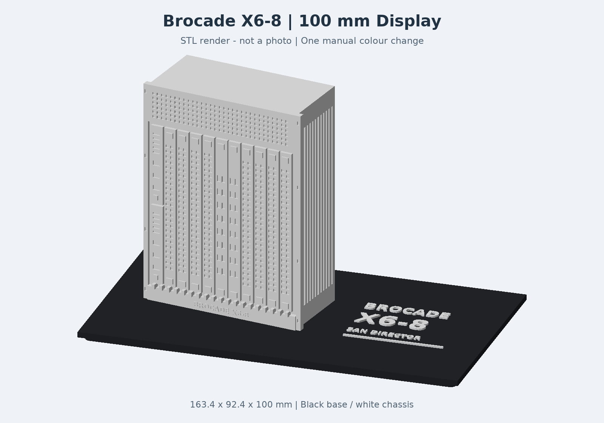

# Brocade X6-8 – 10-cm-Displaymodell

Ein stilisiertes Modell des Brocade SAN Director X6-8 für den Schreibtisch: links das leicht gedrehte Chassis, rechts die Beschriftung, auf einer schwarzen Grundplatte. **100 mm Gesamthöhe**, einschließlich Grundplatte.



## Was herunterladen?

| Datei | Verwendung |
|---|---|
| [Brocade_X6-8_P1S.3mf](models/Brocade_X6-8_P1S.3mf) | In Bambu Studio als Projekt öffnen: P1S, 0,4-mm-Düse, manuelle Farbwechselpause |
| [Brocade_X6-8_100mm.stl](models/Brocade_X6-8_100mm.stl) | Für andere Slicer; Druckeinstellungen und Farbwechsel selbst setzen |

Das Modell ist ein einzelnes verbundenes Teil. Es benötigt weder Montage noch AMS. Ein externer Displayrahmen ist optional und **nicht enthalten**.

## Drucken in Bambu Studio

1. Die **3MF als Projekt** öffnen. Den Drucker auf **Bambu Lab P1S mit 0,4-mm-Düse** prüfen und das passende PLA- und Druckplattenprofil wählen.
2. Flach auf der Grundplatte drucken: **0,20 mm erste und weitere Schichten, 2 Wände, 15 % Füllung**. Keine Stützen vorgesehen.
3. Mit **schwarzem PLA** starten. Nach 21 Schichten ist die 4,2 mm hohe Grundplatte fertig.
4. Die gespeicherte Pause **vor Schicht 22** kontrollieren: erste weiße Schicht bei **Z = 4,4 mm**. An der Pause Schwarz entladen, Weiß laden und bis zu sauberem Weiß spülen. Dann fortsetzen; Modell auf der Druckplatte lassen.
5. Keine zusätzliche Pause hinzufügen. Bei anderer Schichthöhe oder Skalierung den Farbwechsel neu bestimmen.

Für ein einfarbiges Modell die Pause entfernen. Die Vorschau zeigt die geplante Farbverteilung; Bambu Studio kann das Modell trotz manueller Pause einfarbig anzeigen.

**Status:** Geometrie wasserdicht und zusammenhängend. Ein physischer Probedruck wurde nicht dokumentiert. Die Bilder sind Renderings der tatsächlichen STL, keine Druckfotos. Feine Schrift und Ports können je nach Material und Drucker weniger deutlich ausfallen.

## Abmessungen und Gestaltung

- Gesamt: **163,4 × 92,4 × 100 mm** (Breite × Tiefe × Höhe).
- Chassis proportional gegenüber der ersten Version verkleinert; 95,8 mm hoch, um 10° gedreht.
- Acht stilisierte Port-Blades, zwei zentrale Core-Blades, zwei CP-Module links und flache Lüftungsvertiefungen.
- Verkürzte Gehäusetiefe für das Display: dekoratives Modell, kein maßstabsgetreues technisches Replikat.
- Selbst konstruierte Passkontur zum Standardboden des [Displaystands von ShapeShift 3D Creations](https://makerworld.com/de/models/1232070-led-light-display-stand-for-layered-car-art-prints). Die Fremddateien müssen bei Bedarf separat beim Urheber bezogen werden; deren Bedingungen gelten unabhängig. Die geometrische Passprüfung der vorherigen Version ergab keine Überschneidung mit diesem Boden; ein physischer Passversuch steht aus.

## Selbst erzeugen oder ändern

Python 3.12 wird empfohlen. Im Repositoryverzeichnis:

```sh
python -m venv .venv
# Windows: .venv\Scripts\activate
# Linux/macOS: source .venv/bin/activate
python -m pip install -r requirements.txt
python src/build.py
python src/render.py
python src/build.py
```

Der zweite Build übernimmt die neu gerenderte Vorschau in die 3MF. Das Skript benötigt keine privaten Dateien, keine fremden Rahmenmodelle und keine lokale Bambu-Installation. Der vollständige P1S-Profil-Export wird separat unter `third_party/bambu` mit seiner ursprünglichen Lizenz mitgeliefert. Vor dem Drucken Material- und Platteneinstellungen prüfen.

Die Chassisgeometrie und Position stehen in `src/build.py`, die Darstellung in `src/render.py`. `models/geometry-check.json` dokumentiert die Geometrieprüfung. Änderungen an Höhe und Grundplatte erfordern eine erneute Prüfung der Farbwechselhöhe und Passform.

## Lizenz und Herkunft

Eigener Quellcode, selbst erstellte Modellgeometrie und Dokumentation: **[Apache License 2.0](LICENSE)**. Siehe [NOTICE](NOTICE) und [Quellen/Drittanbieter](docs/ATTRIBUTION.md). Fremde Rahmen, Fotos und Bibliotheken werden nicht mitgeliefert oder umlizenziert.

Brocade/Broadcom und Bambu Lab sind Marken ihrer jeweiligen Inhaber. Dieses inoffizielle Hobbyprojekt ist kein Produkt dieser Unternehmen. Das Modell wurde mit KI-gestützter Programmierung erstellt.

## English quick start

Open `models/Brocade_X6-8_P1S.3mf` as a project in Bambu Studio. Select P1S / 0.4 mm nozzle, PLA and the appropriate build plate. Print at 0.2 mm, two walls, 15% infill. Start with black PLA; the saved manual pause before layer 22 (top Z 4.4 mm) lets you load white PLA. No AMS required. Total height including base: 100 mm. Images are STL renders; no physical print has been documented. Third-party display frames are not included. Original project contributions are Apache-2.0 licensed.
