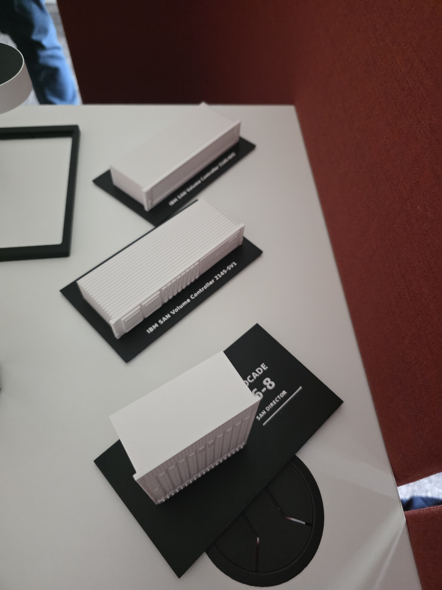
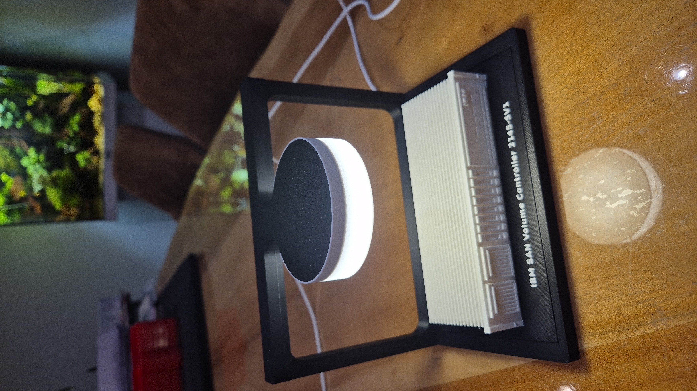

# Rechenzentrum-Miniaturen: Brocade, IBM SVC und Dell

Selbst konstruierte Displaymodelle für den Schreibtisch, mit einer gemeinsamen Einsatzplatte von **163,4 × 92,4 mm**. Modellgeometrie, eigener Code und Dokumentation: **Apache-2.0**.



## Modelle herunterladen

| Modell | Höhe inkl. Platte | STL | Bambu P1S-Projekt |
|---|---:|---|---|
| Brocade X6-8, seitlich arrangiert | 100 mm | [STL](models/Brocade_X6-8_100mm.stl) | [3MF](models/Brocade_X6-8_P1S.3mf) |
| IBM SVC SV1, einzelner Node | 30,2 mm | [STL](models/IBM_SVC_SV1_SingleNode.stl) | [3MF](models/IBM_SVC_SV1_SingleNode_P1S.3mf) |
| IBM SVC SV1, Zwei-Node-Cluster | 57,2 mm | [STL](models/IBM_SVC_SV1_Cluster.stl) | [3MF](models/IBM_SVC_SV1_Cluster_P1S.3mf) |
| IBM SVC SV2, einzelner Node | 30,2 mm | [STL](models/IBM_SVC_SV2_SingleNode.stl) | [3MF](models/IBM_SVC_SV2_SingleNode_P1S.3mf) |
| Dell Compellent SC8000 | 30,2 mm | [STL](models/Dell_Compellent_SC8000.stl) | [3MF](models/Dell_Compellent_SC8000_P1S.3mf) |

Alle 3MF enthalten jeweils nur den eigenen Einsatz auf einer Platte, das P1S-Profil und eine manuelle Farbwechselpause. Auch der SV1-Cluster verwendet hier das Schwarz-Weiß-Profil. Rahmenmodelle und fremde Produktfotos sind nicht eingebettet.

## Originalvorlage: Porsche-/Layered-Car-Displayständer

Die vom Nutzer bestätigte Originalvorlage ist der **[LED Light Display Stand for Layered Car Art Prints von ShapeShift 3D Creations](https://makerworld.com/de/models/1232070-led-light-display-stand-for-layered-car-art-prints#profileId-1250999)**. Der Link führt zum beleuchteten Ständer, nicht zur Geometrie eines Porsche-Fahrzeugs. Unsere Modelle nutzen eine selbst konstruierte, dazu passende Einsatzplatte.

Den Rahmen direkt beim Originaldesigner beziehen. Seine Lizenz gilt unabhängig; seine Dateien sind hier nicht enthalten und werden nicht unter Apache-2.0 gestellt. Verwendet wird der **Standardboden**, nicht die Lemon-Arts-Variante. Die Einsätze können auch ohne Rahmen auf dem Tisch stehen.

## Originalfotos

Beide vom Nutzer zur Veröffentlichung bereitgestellten JPEGs liegen **in Originalauflösung, mit entfernten Foto-Metadaten einschließlich GPS** unter [images/photos](images/photos). [Prüfsummen](images/photos/originals.json) dokumentieren die bereinigten Dateien.

- [datacenter-display-models.jpg](images/photos/datacenter-display-models.jpg): mehrere gedruckte Einsätze, darunter der arrangierte X6-8 und IBM SVC SV1.
- [ibm-svc-sv1-illuminated-display.jpg](images/photos/ibm-svc-sv1-illuminated-display.jpg): IBM SVC SV1 im montierten Rahmen mit eingeschalteter runder Leuchte.



Die Fotos belegen vorhandene Drucke; sie ersetzen keine Messungen der Passform oder Tests aller Varianten. Für Dell und den Zwei-Node-Cluster liegt kein eindeutig zugeordnetes Druckfoto vor. Eine offene Fotolizenz wurde nicht ausdrücklich festgelegt: Die JPEGs sind vom Apache-Lizenzumfang ausgenommen; siehe [Fotohinweise](images/photos/README.md).

## Zweifarbig drucken – ohne AMS

1. Die gewünschte **3MF als Projekt in Bambu Studio öffnen**.
2. **P1S, 0,4-mm-Düse**, passendes PLA und Druckplattenprofil prüfen. Die Projekte verwenden **0,20 mm erste und weitere Schichten, 2 Wände und 15 % Füllung**.
3. Flach auf der Grundplatte drucken. Keine Stützen vorgesehen. Mit **schwarzem PLA** beginnen.
4. Die gespeicherte Pause **vor Schicht 22** kontrollieren: Nach 21 Schichten ist die schwarze Platte 4,2 mm hoch. Weißes PLA laden, bis zu sauberem Weiß spülen und fortsetzen. Das Modell bleibt auf der Druckplatte. Die erste weiße Schicht endet bei **Z = 4,4 mm**.
5. Keine zweite Pause ergänzen. Bei Skalierung oder anderer Schichthöhe den Farbwechsel neu bestimmen.

Für einfarbigen Druck die Pause entfernen. Eine STL enthält keine Druckpause. Die Slicer-Farbdarstellung kann trotz manueller Pause einfarbig bleiben. Bei einem anderen Drucker dessen Profil auswählen und erneut slicen.

## Gestaltung und Prüfung

Stilisierte Nachbildungen mit verkürzter Gehäusetiefe und FDM-gerecht vereinfachten Details. Kein maßstabsgetreues technisches Replikat. Jedes Modell ist ein zusammenhängender, wasserdichter Körper. Die PNGs im Bilderordner sind Renderings der tatsächlichen STL; die beiden JPEGs sind echte Fotos.

Der X6-8 bleibt einschließlich Platte 100 mm hoch, links um 10° gedreht, rechts mit Beschriftung. Die IBM-Modelle haben dekorative Lamellen; SV2 zeigt eine Wabenfront, der SC8000 zwei Lüftungsbereiche.

Ergebnisse der erneuten Slicer- und Geometrieprüfung: [collection-check.json](models/collection-check.json). Slicer-Zeiten und Materialmengen sind Schätzungen ohne manuelle Wechselzeit und zusätzliches Spülmaterial. Geometrische Bodenpassung wurde zuvor geprüft; gemessene Fertigungstoleranzen sind nicht dokumentiert.

## Modelle selbst erzeugen

Python 3.12 wird empfohlen:

```sh
python -m venv .venv
# Windows: .venv\Scripts\activate
# Linux/macOS: source .venv/bin/activate
python -m pip install -r requirements.txt
python src/build.py
python src/build_sv1.py
python src/build_sv1_cluster.py
python src/build_sv2.py
python src/build_sc8000.py
```

`src/render.py` rendert den X6-8. Die gleich benannten `render_sv1.py`, `render_sv1_cluster.py`, `render_sv2.py` und `render_sc8000.py` erzeugen die weiteren Vorschauen. Nach einem Rendering den jeweiligen Build wiederholen, um die neue Vorschau in die 3MF einzubetten. Die Generatoren benötigen keine privaten Dateien oder fremden Rahmenmodelle.

## Lizenz und Herkunft

Eigene Geometrie, Quellcode und Dokumentation: **[Apache License 2.0](LICENSE)**. Die separaten Bambu-Profilvorlagen behalten ihre AGPL-Lizenz; siehe [NOTICE](NOTICE), [Drittanbieterhinweise](docs/ATTRIBUTION.md) und `third_party/bambu`. Die Originalfotos sind gesondert gekennzeichnet. Fremde Rahmen und Produktfotos werden nicht weiterverteilt.

IBM, Dell, Brocade/Broadcom, Porsche und Bambu Lab sind Marken ihrer jeweiligen Inhaber. Dies ist ein unabhängiges Hobbyprojekt, erstellt mit KI-gestützter Programmierung.

## English quick start

Five display variants: Brocade X6-8, IBM SVC SV1 single/cluster, SV2 and Dell SC8000. Open the selected P1S 3MF as a project in Bambu Studio. Use 0.4 mm nozzle, PLA, 0.2 mm layers, two walls and 15% infill. Start in black and load white at the saved pause before layer 22 (top Z 4.4 mm). No AMS required. The original illuminated display stand is linked above, not bundled. JPEGs are user-supplied original print photos; PNGs are renders. Original model/code contributions: Apache-2.0; photos and third-party profiles have separate rights.
